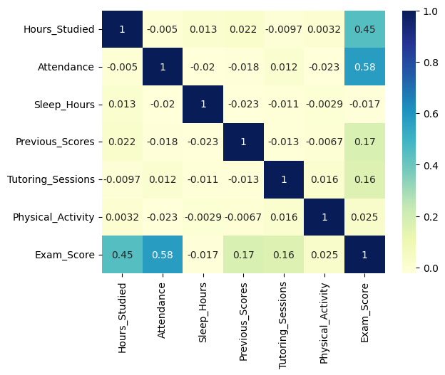
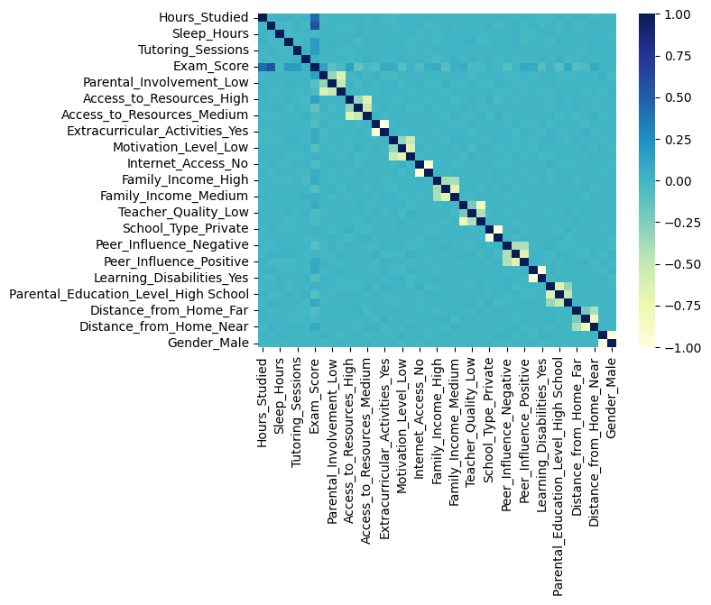

# CNN-Regression-and-Classification
Regression and Classification of data using CNN

The kaggle notebook can be found [here](https://www.kaggle.com/code/samyak03/cnn-regression-and-classification).

## Summary
The aim is to accurately and consistently find the exam scores of students influenced by various factors like hours studied, attendance, access to resources and many more. The dataset can be found [here](https://www.kaggle.com/datasets/lainguyn123/student-performance-factors).

Regression and Classification both are used to find the equivalent scores. For Regression, the data is normalized using Min-Max scaling to fit the values in [0, 1] and can be used with `sigmoid` activation function. As for classification, the distribution of the data is first calculated. According to the results, the data is in Gaussian distribution with exam scores starting from 50 to 101. The data is segregated into 6 categories on the basis of the exam scores and are as 50-60, 60-65, 65-70, 70-75, 75-80, 80-110. The intervals are taken, such that, it fits within the Gaussian distribution and to remove data imbalance.

The CNN models uses the combinations of `Conv1D`, `MaxPooling1D`, `Dropout` and `Dense`. The inputs are fed to the convulational layer(s) and then are flattened to serve as an input for `Dense` layers which lastly goes towards the output layer. For output layer, in regression, `sigmoid` activation is used and for classification, `softmax` activation function is used. For the three different models, they are tested with the test set (not validation set) and original dataset values.

- Regression -> R2 score (goodness of fit) is **69.74%** and loss is **1.21%**. Accuracy, F1 score and Precision cannot be calculated.
- Classification
  - CNN 1 -> accuracy: **93.21%** - f1_score: **90.49%** - loss: **34.73%** - precision: **93.21%**
  - CNN 2 -> accuracy: **84.26%** - loss: **46.49%** - precision: **86.81%** - f1_score: **68.05%**

The plots can be found [here](results/__results___files) but is recommended to refer from the [notebook](cnn-regression-and-classification.ipynb).

The [saved models](results/Model_Data) can be loaded via tensorflow model load. It is mandatory to normalize the input data using the min-max scaling. The file is located [here](results/minmax.pkl). The minimum and maximum values used for normalization for each column [Hours_Studied, Attendance, Sleep_Hours, Previous_Scores, Tutoring_Sessions, Physical_Activity, Exam_Score] is saved in a 2D list.\
*NOTE: Exam_Score is the target column and can be ignored during normalization for model predictions.*

## Preprocessing
### Dataset inspection and visualization
The dataset had no duplicates but several NULL values were found in columns. `78` in `Teacher_Quality`, `90` in `Parental_Education_Level`, and `67` in `Distance_from_Home`. Although, these NULL values can be replaced with the highest frequency or the median data but the entries were dropped so as to preserve the original data. The final shape of the data (rows x columns) is `(6378, 20)`. Out of 20 columns, 7 had numeric values included the target column, `Exam_Scores`. The **heatmap** of the correlation matrix can be used to find the correlations of `Exam_Score`:

### One-hot encoding
Apart from the 7 columns with numeric data, others had data in string format. The strings are categorically placed, e.g., for column `Parental_Involvement`, the only categorical strings used are Low, Medium and High. Similarly, for other columns, all the string data are categorical.

### Normalization
The numerical data of the 7 columns (not one-hot encoded) are normalized using min-max scaling to normalize the values between 0 to 1. This can be later helpful for the regression where the output layer activation function is `sigmoid` which returns the output between 0 to 1. The **heatmap** of the correlation matrix, keeping `Exam_Score` as focus, does not differ greatly from the previous ones indicating the correlation between the one-hot encoded columns are not significant.

Here, all the 7 columns including the target column `Exam_Score` are normalized.

### Classification Segregation
The normalization are passed through similary but for the target column `Exam_Score`, it is not normalized. Rather, it is cut into different bins of its Gaussian distribution. This enables to segregate the data and classify the Exam Score as a part of a range and not a definite value (regression).\
The range of the classification -> **50-60**, **60-65**, **65-70**, **70-75**, **75-80**, **80-110**.

Additionally, the categorized target column is kept in two different formats to serve in two different models. One is the normal 1D array for Sparse Categorical Crossentropy and the other is one-hot encoded for Categorical Crossentropy.

## Model
### Regression

### Classification
#### Basic Model

#### Basic Model with added layers

## Results
### Regression

### Classification
#### Basic Model

#### Basic Model with added layers
